# Practica-2-AzureMachineLearning

## Objetivos 🥅

Al finalizar esta practica contaras con: 
- Con los conociminetos para crear y poner en funcion una Machine Learnign de azure.

## Paso 1 - Inicio de seccion en Azure

Ingresa a la página [ml.azure.com](https://ml.azure.com/home) y posteriormente inicias seccion, una vez iniciada la seccion estaras en la siguiente pestaña:

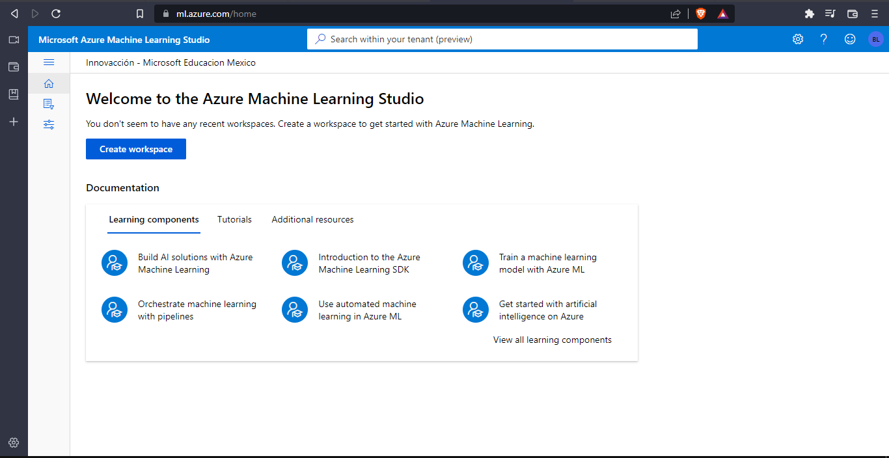

Y daremos clik en create workspace, aqui nos pedira que creemos un area de trabajo nueva, la cual realizaremos en el portal de Azure.

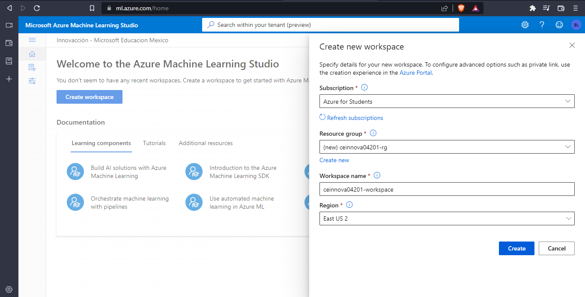

Luego Ingresaremos a la página [portal.azure.com](https://portal.azure.com/) y posteriormente inicias seccion, una vez iniciada la seccion estaras en la siguiente pestaña:

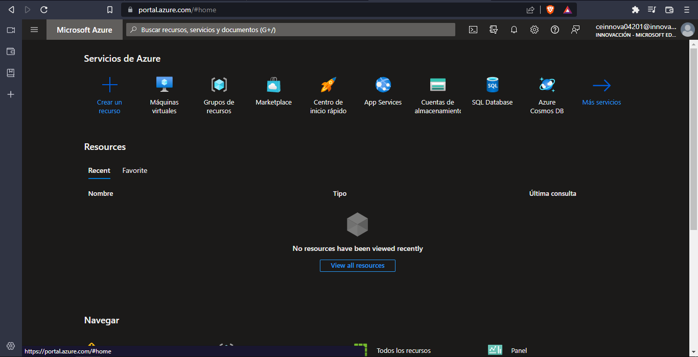

## Paso 2 - Buscar Machine Learning desde el portal de Azure

Te dirigiras al buscador de Azure y buscaremos Machine Learning y seleccionaremos la siguiente opcion:

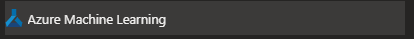

Una vez dentro precionaremos el boton de crear.

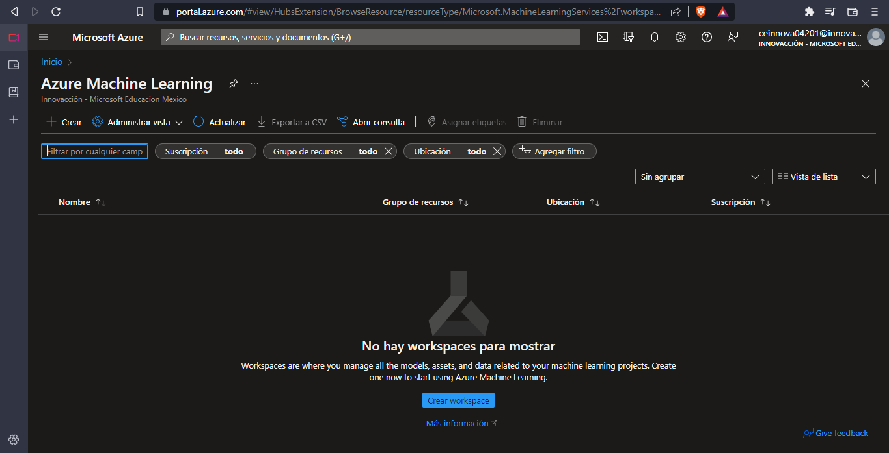

## Paso 3 - Crear el Machine Learning

Una vez estemos en el apartado para crear el Machine Learning, tendremos que ingresar los siguientes datos:

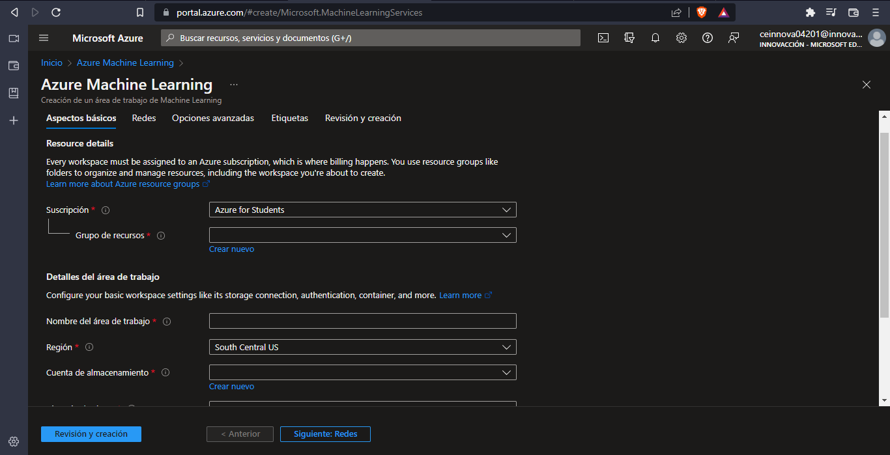

### *Suscripcion*
Seleccionar la suscripcion que deses usar, en mi caso usare "Azure for Students".

### *Grupo de Recursos*
Aqui seleccionaras un grupo de recursos, en dado caso de no tener uno haras lo siguiente.
Precionaras en "Crear nuevo" y le asignaras el nombres que quieras que tenga el grupo de recursos.

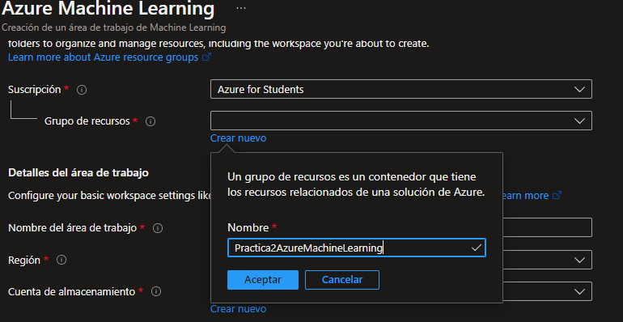

### *Nombre del área de trabajo*
Aqui ingresaremos el nombre que quieras que tenga el área de trabajo.

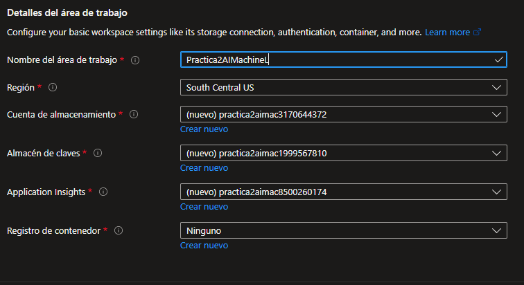

### *Region*
En el apartado de region Seleccionas la region que creas mas conveniente, se recomienda que sea la region en la cual estaran tus usuarios.

*Y los demas apartados los dejamos tal cual, a menos que ocupes cambiar algo por ciertas cuestiones*

Y finalmente precionaremos el boton de revisar y crear.

### *Revisar y Crear*

En este apartado Azure revisara que tengas todo bien y te mostrara lo siguinete:

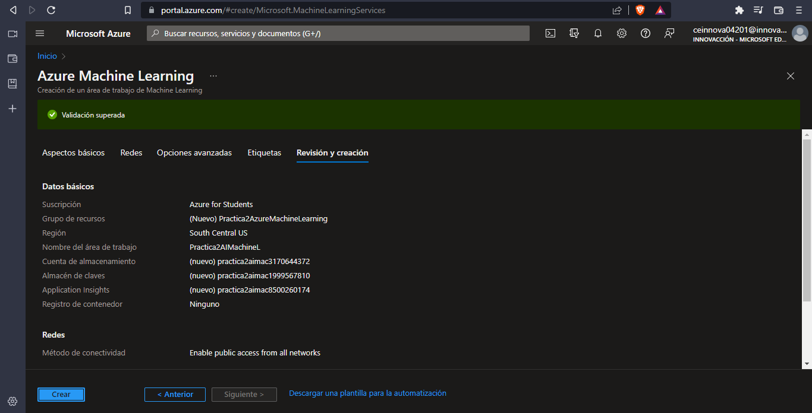

Y por ultimo seleccionamos la opcion de crear y empezara a crearse.

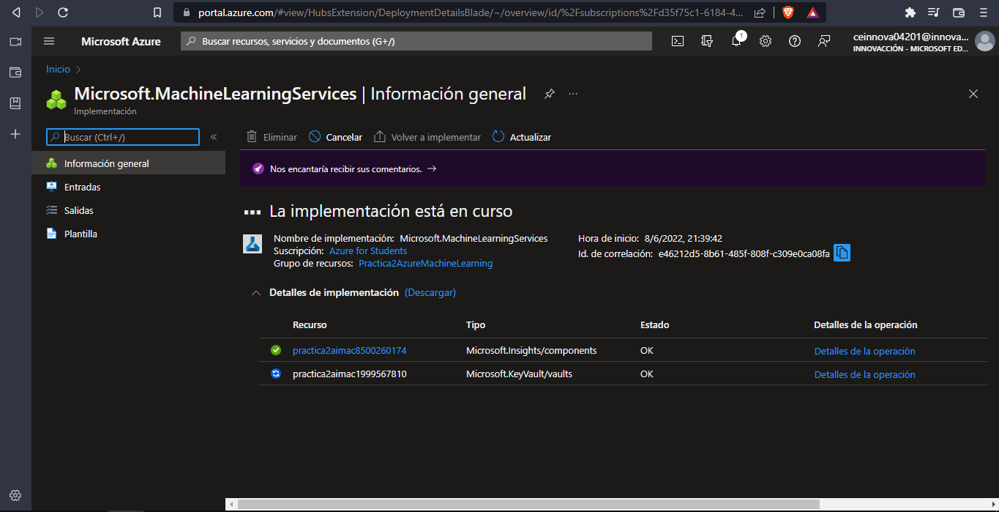

## Paso 4 - Usar Machine Learning

Una vez terminada la creacion del WordPress, precionamos el boton de ir al recurso.

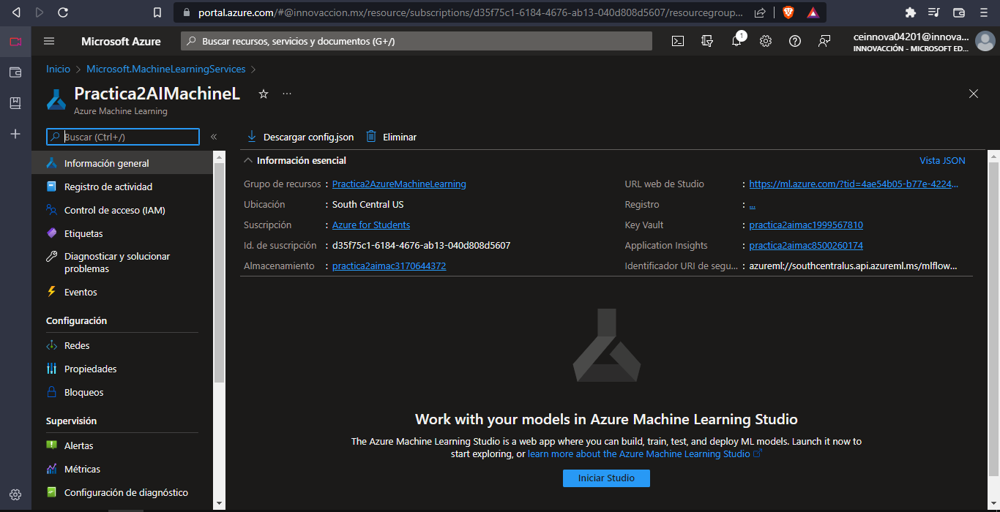

Ahora podemos usar el Machine Learning, para ello nos dirijiremos hacia [ml.azure.com](https://ml.azure.com/home), y ya nos aparecera el Machine Learning que acabamos de crear.

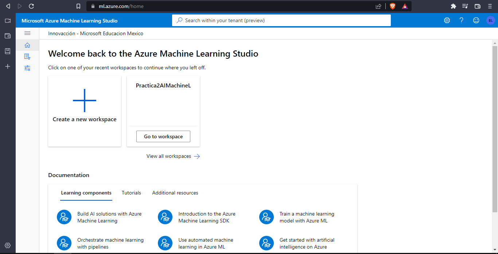

Posteriormente seleccionaremos el Machine Learning que acabamos de crear, en donde dice ir a area de trabajo(Go to workspace).

## Paso 5 - Proceso Machine Learning

Una vez dentro de la area de trabajo, nos dirigiremos al apartado de prcesos (compute), y dentro de este seleccionaremos el proceso que queremos usar.

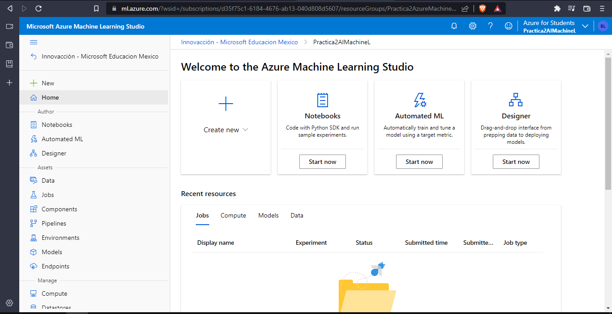

Ahora en instancias de proceso (compute instances), seleccionaremos en crear (new).

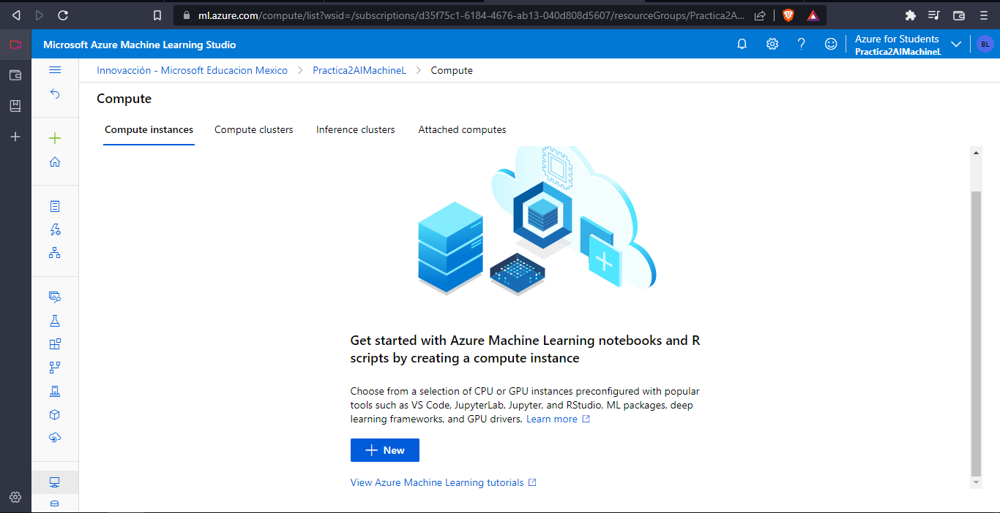

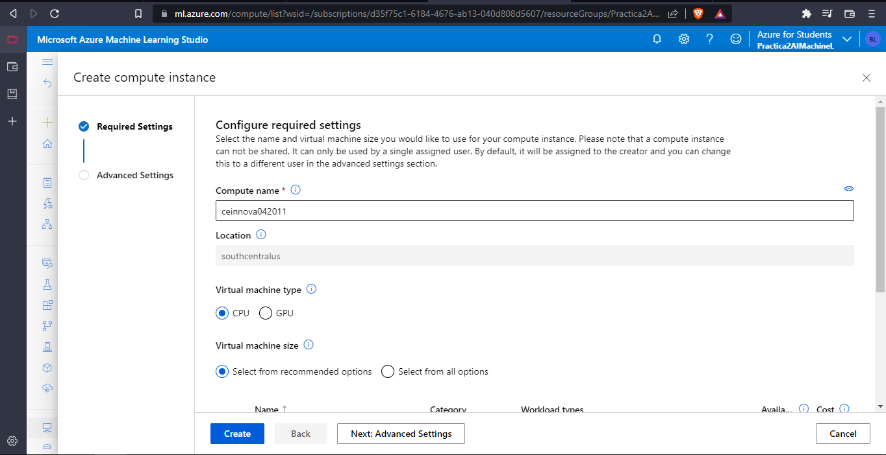

### *Nombre del proceso*
Aqui ingresaremos el nombre que quieras que tenga el proceso.

### *Tipo de Maquina Vitual*
Seleccionaremos el tipo de maquina virtual que queremos usar, en mi caso sera en CPU y "Standard_DS11_v2", y daremos clik en crear.

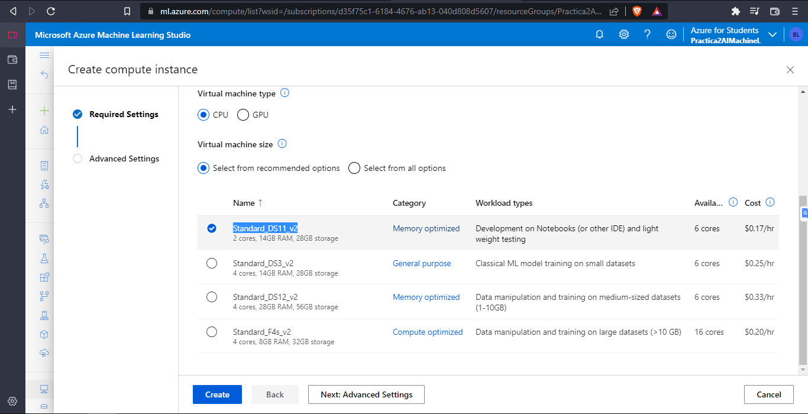

## Paso 6 - NoteBook de Machine Learning

Una vez crada nuestra instancia de proceso, nos dirigiremos al apartado de nootbook.

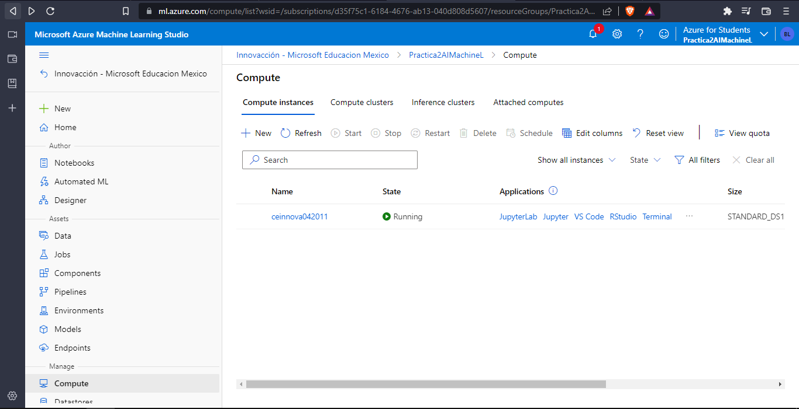

Dentro de notebook, seleccionaremos el proceso que acabamos de crear, y dentro de nustra carpeta de notebook, crearemos un archivo llamado "notebook.ipynb".

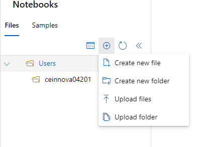

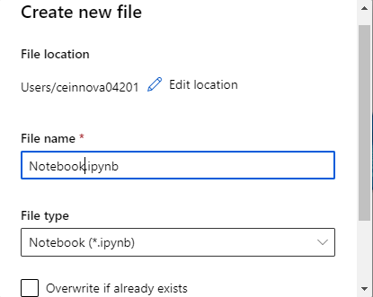

Y dentro de notebook.ipynb, escribiremos lo siguiente:

print("Hola Mundo")

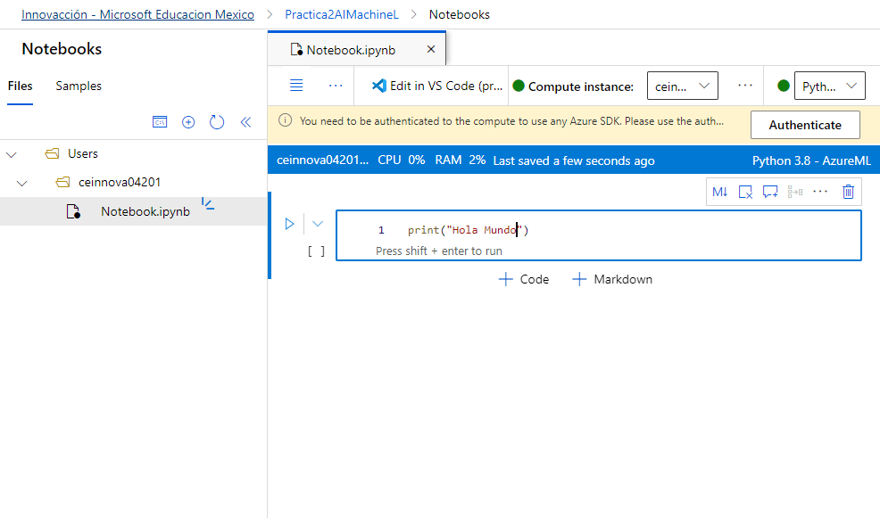